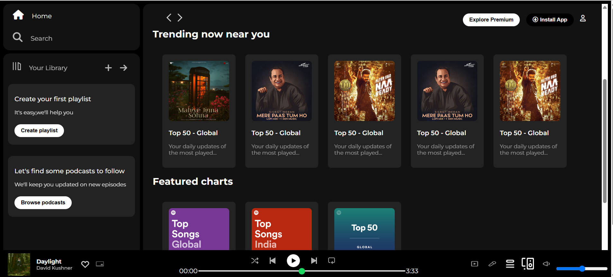

# Spotify-Clone
# 🎵 Spotify Web UI Clone

Static front-end clone of the Spotify Web Player interface. Built using HTML, CSS, and Font Awesome, this project replicates the layout and functionality of Spotify’s player without actual music streaming functionality.

## 📸 Demo

## 🚀 Features

- 🎧 Sidebar navigation with Home, Search, and Your Library
- 📁 Playlist and Podcast creation UI
- 🎵 Responsive music player footer with album details and controls
- 📈 Sections like Recently Played, Trending, and Featured Charts
- 🧭 Sticky navigation bar with Install and Premium buttons
- ✅ Fully responsive layout for large and medium screens
- 🖼 Custom CSS styling inspired by Spotify's dark theme

---

## 🛠️ Tech Stack

- **HTML5** – Page structure
- **CSS3** – Styling and responsive design
- **Font Awesome** – Icons used in nav, player, etc.
- **Google Fonts** – 'Montserrat' font family

